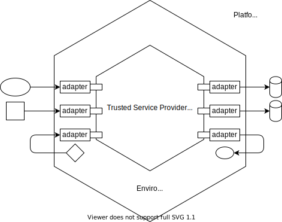

Portability Model
=================

Within the Trusted Services project, an environment represents the execution environment for an application such
as a trusted service provider.  Some example environments are:

  - *opteesp* - Secure partition managed by OP-TEE.
  - *opteeta* - TA running under OP-TEE with access to the Global Platform internal API.
  - *hfsp* - Secure partition managed by Hafnium.

An underlying TEE or SPM that manages a secure processing environment will have its own model for porting to different hardware.
For example, OP-TEE has its own driver model that allows for alternative hardware drivers. In some cases, a secure processing
environment will not provide native support for all hardware that an application depends on.  To address this, the TS
portability model allows:

  - Application interfaces to be adapted to services natively provided by a secure processing environment if they are available.
  - Adapting to platform provided drivers when no native environment support is available.

Ports and Adapters Architecture
-------------------------------

An application is decoupled from any particular environment via a set of interfaces that reflect the needs of the application.
This model conforms to the *ports and adapters* architectural pattern that aims to avoid tight coupling between application
components and any particular environment.  This pattern, also known as the *hexagonal architecture*, is often illustrated as
a hexagonal cell with the application on the inside and the platform on the outside.

The following diagram illustrates how ports and adapters is applied in the trusted services project to provide a model for
application portability.

The portability model has the following characteristics:

  - The application is decoupled from the environment by a set of virtual interfaces (ports) that reflect the needs of the
    application.
  - Those interfaces are realized by a set of adapters that either use native environment services or platform provided
    services.
  - For a given environment, the set of adapters that realize interfaces used by an application will always be the same,
    independent of the platform.
  - A platform presents interfaces that conform to conventional driver and middleware abstractions such as block drivers and
    filesystems.
  - The set of platform interfaces that an application depends on is defined by the set of adapters used for a deployment of an
    application in a particular environment.  This can form the basis for a platform configuration.

The need to use platform provided components will depend on the native features provided by an environment.  For example, the
*opteeta* environment represents the TA environment provided by OP-TEE.  In its role as a trusted OS, OP-TEE provides access to
an implementation of the Global Platform Internal Core API that provides services such as secure storage. Usage of any back-end
hardware is handled by OP-TEE and its own OS components so no additional provision is needed. Bare metal environments such as
secure partitions offer few native facilities so it may be necessary to map application interfaces to platform provided drivers.
Mapping application interfaces to platform drivers is a way of extending the native services provided by an environment.

The portability model allows for an arbitrary partitioning of hardware-backed services between native environment services and
platform drivers.

Portability Model Example
-------------------------

To illustrate usage of the portability model, consider deployments of the following two trusted services:

  - fTPM based on the Microsoft TPM2.0 reference implementation.
  - trustedfirmware.org Crypto service based on the Mbed TLS library.

The Microsoft TPM2.0 reference and Mbed TLS both define their own platform interfaces to allow for platform specific
implementations of features such as roll-back protected storage and entropy.  Although some interfaces are similar between the
two implementations, they are not the same.  These interfaces are classed as ports within the ports and adapters architecture.
To simplify the example, just the entropy platform dependency is considered.  Both fTPM and Crypto service providers need access
to a cryptographic grade RNG to support key generation. How the RNG is realized will depend on:

  - What facilities the environment natively provides.
  - What other trusted services are available on the device.
  - Whether the environment allows for platform specific access to hardware.
  - Availability of a spare hardware TRNG instance.

Adapters will be responsible for adapting both fTPM and Crypto views of an entropy source to a suitable realization.
Some example adapters:

fTPM adapters that realize MS entropy interface (port)
''''''''''''''''''''''''''''''''''''''''''''''''''''''
  - *Adapts to crypto service* - Uses crypto service generate_random operation
  - *Adapts to TEE API*	- Uses native TEE OS
  - *Adapts to TRNG* - Uses platform TRNG hardware

Crypto adapters that realize Mbed TLS entropy source interface (port)
'''''''''''''''''''''''''''''''''''''''''''''''''''''''''''''''''''''
  - *Adapts to fTPM* - Uses TPM2 getrandom command
  - *TEE API*	- Uses native TEE OS
  - *TRNG* - Uses platform TRNG hardware

The above examples reveal that for a given environment, a port may be realized by more than one type of adapter. For example, an
fTPM deployed within a secure partition could source entropy from either TRNG hardware or from the Crypto service.  This
ambiguity may be resolved by various strategies such as:

  1. Allow a service profile to be applied at build time that defines a core set of mandatory trusted services.  A build-time
     selection of alternative adapters is made, based on available core services.
  2. A built image for a trusted service deployment to a particular environment includes the superset of adapters that could be
     used.  A runtime configuration is applied, that specifies which adapters to use.

Providing Platform Firmware
---------------------------

A goal of the TS project is to reduce barriers to deploying trusted services on different hardware platforms. To this end,
build-time and run-time coupling between TS project and platform components should be minimized. Platform providers should be
free to make any of the following choices:

  - Reuse existing drivers and driver frameworks (e.g. from tf-a, an RTOS, CMSIS).
  - Provide platform components as part of a BSP.
  - Maintain platform components in separate repos.
  - Operate independent test, bug reporting and release processes for platform components.
  - Control the logical organization and naming of different platforms within the TS project.
  - Maintain whatever platform configuration files that are needed within the provider's sub-tree within the TS project.

The platform top-level directory within the TS project provides a structure that allows platform specific components to be
contributed by different providers.  Different providers are represented beneath the platform/providers directory.  The virtual
platform interfaces used by some adapters are defined under platform/interface.  The directory structure beneath a platform
provider's parent is organized to reflect the provider's own naming scheme for different hardware.  Supported platforms are each
represented by a leaf sub-directory within the provider's subtree.

For Arm provided platforms, the structure will look something like this::

  platform
      |-- interface
      |-- providers
              |--arm
                  |-- corstone700
                  |-- fvp
                       |-- fvp_base_aemva
                       |-- fvp_base_revc-2xaemv8a
                                  |-- platform.cmake

Under each platform leaf directory is a file called *platform.cmake*.  This file implements the common configuration and build
interface that will be used during the deployment build process.  How this interface is realized is entirely down to the
platform provider.  An implementation will do things like setting configuration variables for SoC, board and driver selection.
Any additional files needed to support platform configuration and build may be included within the platform provider's sub-tree.

For product developers who want to define and maintain their own private platforms, it should be possible to override the
default platform/providers directory path to allow an alternative sub-tree to be used.  A product developer is free to organize
a private sub-tree in any way that suites their needs.

Although the TS project structure doesn't mandate it, platform specific firmware is likely to live outside of the TS project.
The ability to reuse existing drivers and driver frameworks is important for promoting adoption across hardware from different
vendors.  Board and silicon vendors may reuse existing CI and project infrastructure for platform components that they maintain.

Some special platforms are provided by the TS project itself.  These are represented beneath the *ts* provider.
Current TS platforms are:

.. list-table::
  :header-rows: 1
  :widths: 10, 90

  * - TS Platform
    - Purpose
  * - ts/vanilla
    - | A platform that never provides any drivers. The ts/vanilla platform should be used when an environment provides its own
      | device framework and no additional drivers need to be provided by the platform. An attempt to build a deployment with
      | platform dependencies on the vanilla platform will result in a build-time error. The vanilla platform is selected by
      | default at build-time if no explicit platform has been specified.
  * - ts/mock
    - | A platform that provides a complete set of drivers that may be selected when building any deployment. The platform uses
      | mock drivers that don't offer functionality suitable for production builds. The mock platform is useful for CI build
      | testing of deployments with platform dependencies. You should always expect a deployment with platform dependencies to
      | build when TS_PLATFORM=ts/mock.

Determining a Platform Configuration for a Deployment
-----------------------------------------------------

The TS project supports building and installing an application image into different environments that could be hosted on
different hardware platforms.  A platform is characterized by SoC and board-level hardware and possibly by OS type components
such as device drivers and middleware.  To deploy an application that depends on platform drivers, you need to tie-down:

  - *Application name* - such as the name of the service e.g. crypto, secure-storage, attestation, tpm.
  - *Environment* - the environment in which the application will run e.g. bare metal secure partition, Global Platform TEE,
    Trusty TEE, microcontroller RTOS.
  - *Platform* - the hardware platform that hosts the environment.

The following example illustrates how these parameters are specified via the deployment build command line::

  cd trusted-services/deployments/crypto/opteesp
  cmake -S . -B build -DTS_PLATFORM=arm/fvp/fvp_base_revc-2xaemv8a

The combination of <application name> + <environment> allows a set of build-time platform dependencies to be generated, based on
the set of adapter components used for the deployment.   This information is passed via the platform build interface to the
platform.cmake file for the specified platform via a CMake target property called TS_PLATFORM_DRIVER_DEPENDENCIES.  The
translation of the platform dependency information to a suitable build configuration is handled by the platform.cmake file for
the selected platform.  This separation gives a platform provider the freedom to use their own configuration conventions when
reusing existing drivers.

To allow for out-of-tree platform definitions, the root path for platform definitions may be modified by providing an
alternative value for TS_PLATFORM_ROOT.  Both TS_PLATFORM and TS_PLATFORM_ROOT may be set via the CMake command line or using
environment variables.

Adapters
--------

As described above, the role of an adapter conforms to the Ports and Adapters pattern.  With reference to the hexagonal cell
representation, an adapter implements an application defined inside interface and adapts it to either an environment interface
or an outside platform interface.  Within the TS project, adapters are treated like any other software component and may be
reused whenever appropriate.  However, because an adapter implements an application defined interface, adapter implementations
will tend to be tied to a particular application or component.  The complexity of adapter implementations can vary a lot and
will depend on how closely an inside interface matches either an outside interface or an environment interface.

The collection of adapters used for a deployment is defined by the environment specific build file for a deployment.  Deployment
of the same service into a different environment may result in a different set of adapters being used.  As each adapter is
treated as a separate component, a separate component.cmake file exists for each adapter.  When an adapter depends on one or
more platform interfaces, the dependency must be declared in the adapter's component.cmake file.  This information forms the
basis for the platform build configuration.

--------------

*Copyright (c) 2021, Arm Limited and Contributors. All rights reserved.*

SPDX-License-Identifier: BSD-3-Clause
