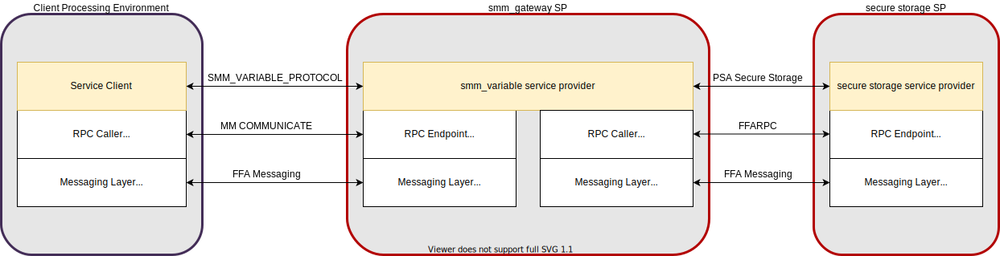

UEFI SMM Services
=================
The Trusted Services project provides support for UEFI System Management Mode (SMM) services via the
SMM Gateway secure partition. The SMM Gateway adopts the API Gateway design pattern, popular in
microservices architecture. The pattern decouples clients from backend service providers using an
API gateway that presents a domain specific interface to clients while delegating operations to a
set of backend microservices. An API gateway will typically use multiple backend services and may
perform protocol translation while presenting a single service entry point for clients. The SMM
Gateway works in a similar manner - clients access SMM services using standard SMM protocol messages,
carried by an RPC mechanism. Service requests are forwarded by the SMM Gateway to backend service
providers for operations such as secure persistent storage and signature verification.

SMM Gateway is intended to be used on non-EDK2 platforms as an alternative to the EDK2 StandaloneMM
(StMM) component. The current SMM Gateway version only supports the SMM Variable service. Additional
SMM service providers may be added to SMM Gateway if required. By deliberately limiting functionality
and exploiting backend services, the SMM Gateway SP can be significantly lighter-weight than StMM.
This option is intended to be used on more resource constrained devices that tend to use u-boot.
There is of course the possibility that other SMM services will need to be supported in the future.
In such cases, a judgement should be made as to whether StMM should be used rather than extending the SP.

.. uml:: uml/SmmGatewayOverview.puml

SMM Variable Service
--------------------
Overview
''''''''
UEFI Variable support is provided by the *smm_variable* service provider component. This service provider
is structured in the same way as other service providers within the TS project. Features of this
component are:

  * Source file location:  ``components/service/smm_variable``
  * Public interface definitions: ``protocols/service/smm_variable``
  * Can be used with any RPC layer - not tied to MM Communicate RPC.
  * Volatile and non-volatile storage is accessed via instances of the common *storage_backend* interface.

The *smm-gateway/opteesp* deployment integrates the *smm_variable* service provider with the following:

  * An MM Communicate based RPC endpoint.
  * A *mock_store* instance for volatile variables.
  * A *secure_storage_client* for non-volatile variables.

During SP initialization, the *smm-gateway* uses pre-configured information to discover a backend secure
storage SP for NV storage.

The following diagram illustrates how the *smm_variable* service provider is integrated into the *smm-gateway*.

Because the *smm_variable* service provider is independent of any particular environment, alternative deployments
are possible e.g.

  * *smm_variable* service provider running within a GP TA with storage off-loaded to the GP TEE Internal API.
  * *smm_variable* service provider running within a secure enclave with its own internal flash storage.

Supported Functions
'''''''''''''''''''
The *smm_variable* service provider supports the following functions:

.. list-table::
  :header-rows: 1

  * - SMM Variable Function
    - Purpose
    - Backend service interaction
  * - SMM_VARIABLE_FUNCTION_GET_VARIABLE
    - Get variable data identified by GUID/name.
    - Query index and get object from appropriate storage backend.
  * - SMM_VARIABLE_FUNCTION_GET_NEXT_VARIABLE_NAME
    - Called multiple times to enumerate stored variables.
    - Find variable in index and return next.
  * - SMM_VARIABLE_FUNCTION_SET_VARIABLE
    - Adds a new variable or updates an existing one.
    - | Sets object in storage backend and if necessary, updates index
      | and syncs to storage.
  * - SMM_VARIABLE_FUNCTION_QUERY_VARIABLE_INFO
    - Returns information about the variable store.
    - Iterates over stored variables to determine space used.
  * - SMM_VARIABLE_FUNCTION_EXIT_BOOT_SERVICE
    - Called by OS when boot phase is complete.
    - | Updates view of runtime state held by smm_variable service provider.
      | State variable used when implementing state dependent access control.
  * - SMM_VARIABLE_FUNCTION_VAR_CHECK_VARIABLE_PROPERTY_SET
    - | Set constraints that are checked on the SetVariable operation.
      | Allows a platform to set check policy.
    - | Variable index holds variable check constraints object for each variable.
      | This is updated by this function.
  * - SMM_VARIABLE_FUNCTION_VAR_CHECK_VARIABLE_PROPERTY_GET
    - Get the variable check constraints.
    - Reads the variable check constraints object.
  * - SMM_VARIABLE_FUNCTION_GET_PAYLOAD_SIZE
    - | Returns the maximum variable data size, excluding any
      | auth header.
    - | Considers size constraints imposed by backend stores and RPC response
      | payload constraints.

Supported Variable Attributes
'''''''''''''''''''''''''''''
The following variable attributes are supported:

.. list-table::
  :widths: 3 1 3
  :header-rows: 1

  * - SMM Variable Attribute
    - Support
    - Comment
  * - EFI_VARIABLE_NON_VOLATILE
    - yes
    - Determines which storage backend is used.
  * - EFI_VARIABLE_BOOTSERVICE_ACCESS
    - yes
    - Boot service access controlled by smm_variable service provider.
  * - EFI_VARIABLE_RUNTIME_ACCESS
    - yes
    - Runtime access controlled by smm_variable service provider.
  * - EFI_VARIABLE_HARDWARE_ERROR_RECORD
    - no
    -
  * - EFI_VARIABLE_AUTHENTICATED_WRITE_ACCESS
    - no
    -
  * - EFI_VARIABLE_TIME_BASED_AUTHENTICATED_WRITE_ACCESS
    - not yet
    - Will be needed for secure boot support
  * - EFI_VARIABLE_APPEND_WRITE
    - yes
    - Implemented by overwriting entire variable data.

SMM Variable Tests
''''''''''''''''''
The following test components exist for the SMM Variable service:

.. list-table::
  :header-rows: 1

  * - Test Component
    - Description
    - Included in deployments
  * - ``component/service/smm_variable/backend/test``
    - | Component tests for the variable_index and variable_store backend
      | components. Can be run in a native PC environment.
    - ``deployments/component-test/*``
  * - ``component/service/smm_variable/test/service``
    - | End-to-end service level tests that call service operations from
      | the perspective of a client.  Can be run in a native PC environment
      | or on the Arm target platform.
    - | ``deployments/ts-service-test/linux-pc``
      | ``deployments/uefi-test/arm-linux``

SMM Gateway Build Configuration
-------------------------------
The smm-gateway SP image may be built using the default configuration parameters defined
within relevant source files. In practice, it is likely that at least some configuration
values will need to be overridden. The following table lists build-time configuration
parameters that may be overridden by global C pre-processor defines.

.. list-table::
  :widths: 2 2 2 1
  :header-rows: 1

  * - Config define
    - Usage
    - File
    - Default value
  * - SMM_GATEWAY_MAX_UEFI_VARIABLES
    - Maximum number of variables
    - ``deployments/smm-gateway/smm_gateway.c``
    - 40
  * - SMM_GATEWAY_NV_STORE_SN
    - The service ID for the backend NV variable store
    - ``deployments/smm-gateway/smm_gateway.c``
    - Protected Storage SP

MM Communicate RPC Layer
------------------------
To maintain compatibility with existing SMM service clients, an MM Communicate based RPC
layer has been developed that uses the same 'carveout' buffer scheme as StMM. When SMM
Gateway is used instead of StMM, existing SMM variable clients should interoperate seamlessly.
The MM Communicate RPC components implement the standard TS RPC interfaces and can be used as
a general purpose RPC for calls from normal world to secure world. The following MM Communicate
RPC components have been added:

  * ``components/rpc/mm_communicate/endpoint/sp`` - an RPC endpoint that handles FFA direct
    calls with MM Communicate and SMM message carried in a shared 'carveout' buffer. Call requests
    are demultiplexed to the appropriate service interface based on the service GUID carried in
    the MM Communicate header.  Suitable for use in SP deployments.
  * ``components/rpc/mm_communicate/caller/linux`` - an RPC caller that calls service operations
    associated with the destination service interface from Linux user-space. Uses the MM Communicate
    protocol, sent over FFA using the Debug FFA kernel driver.  Service level tests that run against
    the SMM Gateway use this RPC caller for invoking SMM service operations.

The following register mapping is assumed for FFA based direct calls to an SP that handles the MM
Communicate RPC protocol:

.. list-table::
  :widths: 1 2 2 2
  :header-rows: 1

  * - Registers
    - FF-A layer
    - MM_COMMUNICATE Request
    - MM_COMMUNICATE Response
  * - W0
    - Function ID
    - | FFA_MSG_SEND_DIRECT_REQ
      | (0x8400006F/0xC400006F)
    - | FFA_MSG_SEND_DIRECT_RESP
      | (0x84000070/0xC4000070)
  * - W1
    - Source/Destination ID
    - Source/Destination ID
    - Source/Destination ID
  * - W2/X2
    - Reserved
    - 0x00000000
    - 0x00000000
  * - W3/X3
    - Parameter[0]
    - Address of the MM communication buffer
    - | ARM_SVC_ID_SP_EVENT_COMPLETE
      | (0x84000061/0xC4000061)
  * - W4/X4
    - Parameter[1]
    - Size of the MM communication buffer
    - SUCCESS/[error code]
  * - W5/X5
    - Parameter[2]
    - 0x00000000
    - 0x00000000
  * - W6/X6
    - Parameter[3]
    - 0x00000000
    - 0x00000000
  * - W7/X7
    - Parameter[4]
    - 0x00000000
    - 0x00000000

--------------

*Copyright (c) 2021-2022, Arm Limited and Contributors. All rights reserved.*

SPDX-License-Identifier: BSD-3-Clause
